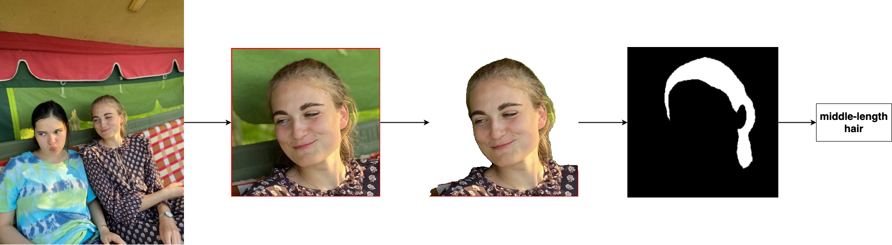

# Hair classifier
Classifier for hair length

<p align="center">
  
</p>

## Installing:
```
pip install -r requirements.txt
```

## Testing
```
python main.py --in-dir "imgs/"
```
Дополнительно в коде можно настроить так, чтобы bbox для лица и маски волос сохранялись в указанную `out-dir` директорию.

## Solution

Изображение -> bounding box для лица -> маска для волос -> сверточный классификатор на pretrained resnet'e -> метка класса

- [маска для волос](./hair_segmentation)
- [bounding box для лица](./face_detection)
- [скрипт для тренировки классификатора](./train.py)

## ToDo

Есть варианты для модель, которые не опробованы:
- написать свою CNN, которая была бы поменьше;
- попробовать посчитать площадь, координаты, в общем, обойтись без изображений.

Нагенерить в качестве дополнительных данных еще изображений для каждой категории.

## Useful links

- [face-detection](https://github.com/Tencent/FaceDetection-DSFD)
- [face-parsing](https://github.com/zllrunning/face-parsing.PyTorch)
